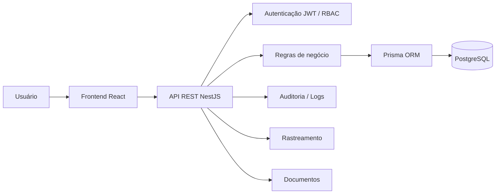

# MOVAIQ — Showcase Público

> Plataforma SaaS para gestão de transportes e fretes.

O **MOVAIQ** é um sistema desenvolvido para centralizar operações de transporte em uma única plataforma, reunindo gestão de clientes, motoristas, veículos, cargas, fretes, rastreamento, documentos, despesas, indicadores e auditoria.

Este repositório é uma **vitrine pública do projeto**. O código-fonte comercial permanece privado.

---

## 🚚 Visão geral

O projeto foi pensado para resolver problemas comuns de operações de transporte, como:

- informações espalhadas em diferentes controles;
- dificuldade para acompanhar o andamento dos fretes;
- falta de separação entre empresas e usuários;
- necessidade de controlar documentos, despesas e histórico;
- baixa visibilidade operacional e financeira.

O MOVAIQ reúne esses fluxos em uma aplicação web com backend e frontend separados.

---

## 🧱 Arquitetura

A arquitetura foi organizada para separar interface, regras de negócio, autenticação, persistência de dados e módulos operacionais.

---

## 🛠️ Stack principal

### Backend
- Node.js
- NestJS
- TypeScript
- Prisma ORM
- PostgreSQL
- JWT
- Passport
- Swagger
- Jest

### Frontend
- React
- TypeScript
- Vite
- Axios
- React Router
- CSS responsivo

### Qualidade e fluxo de desenvolvimento
- Git
- GitHub
- GitHub Actions
- Postman
- testes automatizados
- validação de DTOs
- organização modular

---

## 🔐 Segurança e controle de acesso

O sistema inclui recursos voltados à proteção e organização dos dados:

- autenticação com JWT;
- autorização por perfil de usuário;
- RBAC;
- isolamento de dados por empresa;
- validação de entrada;
- rotas protegidas;
- logs de auditoria;
- controle de acesso a operações sensíveis.

---

## 📦 Principais módulos

### Usuários e empresas
Cadastro de empresas e usuários com perfis e regras de acesso.

### Clientes
Cadastro e gestão de clientes vinculados à operação.

### Motoristas
Gestão de motoristas, dados cadastrais e documentos.

### Veículos
Cadastro e vínculo de veículos à operação.

### Cargas
Controle das cargas que serão transportadas.

### Fretes
Criação, acompanhamento e atualização de status dos fretes.

Fluxos de status incluem etapas como:

- PENDING
- LOADING
- IN_TRANSIT
- DELIVERED
- CANCELED

### Rastreamento
Registro e acompanhamento de eventos durante o transporte.

### Documentos
Gerenciamento de documentos relacionados à operação.

### Despesas e financeiro
Registro de custos e apoio à visão financeira dos fretes.

### Dashboard
Indicadores operacionais e financeiros para acompanhamento da operação.

### Auditoria
Registro de ações importantes realizadas no sistema.

---

## 🧠 Regras de negócio trabalhadas

Durante o desenvolvimento, foram implementados cenários como:

- impedir conflitos em vínculos de motoristas com fretes ativos;
- controlar transições de status;
- garantir acesso apenas aos dados da empresa do usuário;
- proteger endpoints por autenticação e perfil;
- validar documentos e dados antes de operações sensíveis;
- manter histórico de alterações relevantes.

---

## 🧪 Testes e qualidade

O projeto possui testes automatizados para regras de negócio e serviços críticos.

Também são utilizados:

- Jest;
- validações de entrada;
- análise de cobertura;
- GitHub Actions;
- verificações antes de merge;
- revisão de segurança e regressões.

---

## 📱 Interface

O frontend foi desenvolvido para uso em desktop e dispositivos móveis, com foco em:

- dashboard;
- fretes;
- clientes;
- motoristas;
- veículos;
- cargas;
- documentos;
- despesas;
- auditoria;
- perfil do usuário.

---

## 🎯 Objetivo do projeto

O MOVAIQ nasceu como um projeto de desenvolvimento completo e evoluiu para uma aplicação com arquitetura, regras de negócio e recursos próximos de um produto SaaS comercial.

Além da implementação técnica, o projeto envolve decisões sobre:

- produto;
- segurança;
- experiência do usuário;
- organização de domínio;
- escalabilidade;
- manutenção;
- qualidade de software.

---

## 🔒 Código-fonte

O código-fonte do backend e do frontend **não é publicado neste repositório**, pois o MOVAIQ é um projeto com finalidade comercial.

Este showcase apresenta apenas informações suficientes para demonstrar arquitetura, tecnologias, funcionalidades e decisões técnicas sem expor propriedade intelectual ou detalhes sensíveis da implementação.

---

## 🌐 Portfólio

Veja também meu portfólio profissional:

https://eckstein75.github.io/projeto-portfolio/

---

## 👨‍💻 Autor

**Mauricio Gabriel Eckstein**  
Desenvolvedor Backend / Full Stack

- GitHub: https://github.com/eckstein75
- LinkedIn: https://www.linkedin.com/in/mauricio-eckstein/

---

## 📌 Tecnologias em destaque

`Node.js` `NestJS` `TypeScript` `React` `PostgreSQL` `Prisma` `JWT` `RBAC` `Jest` `Swagger` `GitHub Actions`

